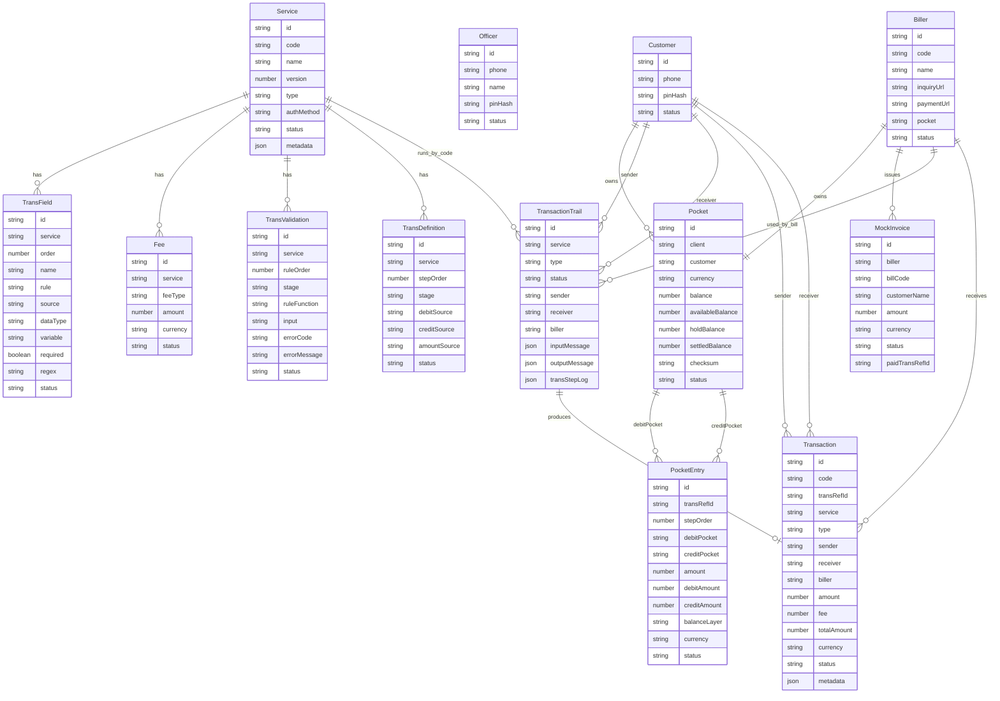

# Mini Wallet ERD

Tai lieu nay chi tap trung vao model va quan he du lieu cua app hien tai.
Sequence runtime nam trong [SEQUENCE_DIAGRAMS.md](./SEQUENCE_DIAGRAMS.md).

## 1. ERD Tong Quan

## 2. Nhom Identity

| Model | Vai tro | File |
|---|---|---|
| `Customer` | User cuoi, login bang phone + PIN, so huu customer pocket | `api/models/Customer.js` |
| `Officer` | Operator/backoffice, dung Cash-in va Config | `api/models/Officer.js` |

## 3. Nhom Wallet/Ledger

| Model | Vai tro | File |
|---|---|---|
| `Pocket` | Vi tien cua customer/biller/system/bank, co snapshot `availableBalance`, `holdBalance`, `settledBalance`, `checksum` va `status` | `api/models/Pocket.js` |
| `PocketEntry` | Dong ghi so double-entry cho tung buoc debit/credit, co debit amount va credit amount rieng | `api/models/PocketEntry.js` |
| `TransactionTrail` | Runtime record cua request/confirm/verify | `api/models/TransactionTrail.js` |
| `Transaction` | Receipt chinh thuc sau khi ledger done | `api/models/Transaction.js` |

## 4. Nhom Config-Driven

| Model | Vai tro | File |
|---|---|---|
| `Service` | Khai bao service code, type, auth method, actor role | `api/models/Service.js` |
| `TransField` | Field builder va validation shape cho `TRANSBODY` | `api/models/TransField.js` |
| `Fee` | Phi cua service | `api/models/Fee.js` |
| `TransValidation` | Rule nghiep vu theo stage | `api/models/TransValidation.js` |
| `TransDefinition` | `glSteps`: source debit/credit/amount | `api/models/TransDefinition.js` |
| `Biller` | Mock external biller co `inquiryUrl`, `paymentUrl`, pocket | `api/models/Biller.js` |
| `MockInvoice` | Hoa don demo cho biller EVN | `api/models/MockInvoice.js` |

## 5. Collection Name Note

Mot so model config da doi ten de dung thuat ngu design, nhung van giu
`tableName` cu:

| Model moi | Collection cu |
|---|---|
| `Service` | `serviceconfig` |
| `TransField` | `transactionfield` |
| `TransValidation` | `transactionvalidation` |
| `TransDefinition` | `transactiondefinition` |

Ly do: de rename code cho de doc ma khong phai drop/import lai Mongo data.
