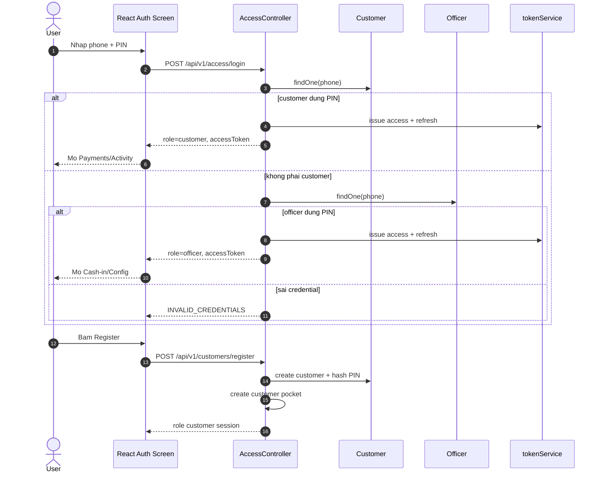
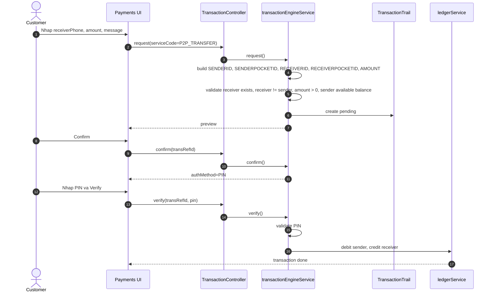
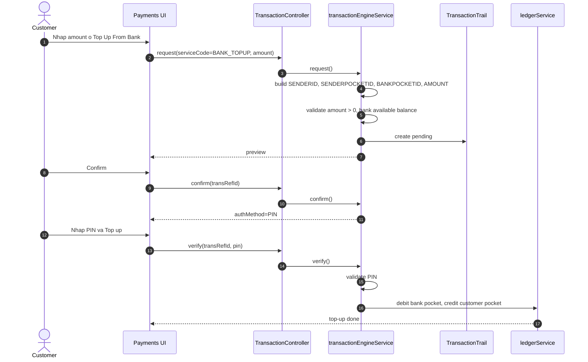
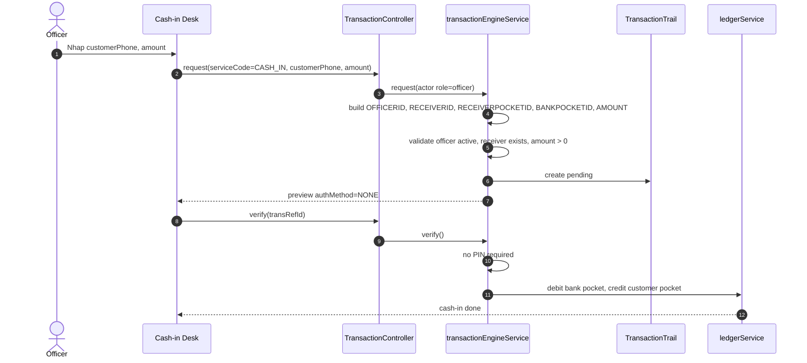
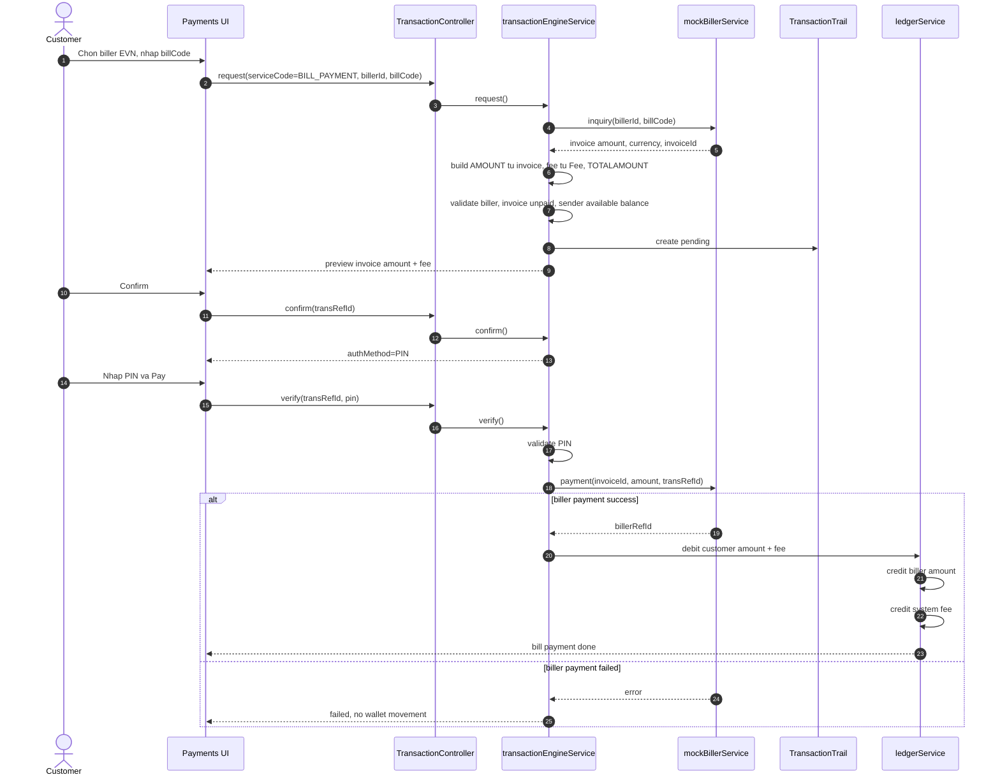

# Mini Wallet Sequence Diagrams

Tai lieu nay mo ta runtime hien tai cua app. ERD nam trong [ERD.md](./ERD.md).

## 1. Login Va Register

Man login public khong chia truoc customer/officer. Backend tu check customer
truoc, sau do check officer. Sau login frontend moi biet role.



## 2. Runtime Config-Driven Chung

Tat ca service chay qua bo API chung:

- `POST /api/v1/transactions/request`
- `POST /api/v1/transactions/confirm`
- `POST /api/v1/transactions/verify`

```mermaid
sequenceDiagram
    autonumber
    actor Actor as Customer/Officer
    participant UI as React Dashboard
    participant API as TransactionController
    participant Engine as transactionEngineService
    participant Service
    participant Field as TransField
    participant Fee
    participant Validation as TransValidation
    participant Trail as TransactionTrail
    participant Definition as TransDefinition
    participant Ledger as ledgerService
    participant Entry as PocketEntry
    participant Tx as Transaction

    Actor->>UI: Submit service form
    UI->>API: request(serviceCode, parameters)
    API->>Engine: request(actor, parameters)
    Engine->>Service: load active Service
    Engine->>Field: load active fields
    Engine->>Fee: load active fee
    Engine->>Validation: run request validations
    Engine->>Trail: create pending trail with TRANSBODY
    Engine-->>UI: preview(transRefId, amount, fee, totalAmount)

    Actor->>UI: Confirm preview
    UI->>API: confirm(transRefId)
    API->>Engine: confirm(actor, transRefId)
    Engine->>Trail: append CONFIRM_DONE
    Engine-->>UI: authMethod

    Actor->>UI: Verify (PIN neu authMethod=PIN)
    UI->>API: verify(transRefId, pin?)
    API->>Engine: verify(actor, transRefId, pin)
    Engine->>Trail: find pending trail
    Engine->>Validation: run verify validations
    Engine->>Definition: load glSteps
    Engine->>Ledger: execute steps in DB transaction
    Ledger->>Entry: create PocketEntry rows
    Ledger->>Tx: create final Transaction
    Ledger->>Trail: mark done
    Engine-->>UI: receipt
```

## 3. P2P Transfer

Service: `P2P_TRANSFER`



## 4. Bank Top-Up

Service: `BANK_TOPUP`

Day la luong user tu nap tien tu bank lien ket vao vi. Khac voi `CASH_IN`
la operator nap ho/ghi nhan tien ngoai he thong.



## 5. Officer Cash-In

Service: `CASH_IN`

Luon operator/backoffice trigger. Auth method la `NONE`.



## 6. Bill Payment

Service: `BILL_PAYMENT`

Current implementation goi mock biller payment trong stage `external_payment`
truoc khi ledger noi bo duoc ghi. Neu biller fail thi engine khong tao
`Transaction` va khong tru tien vi.


