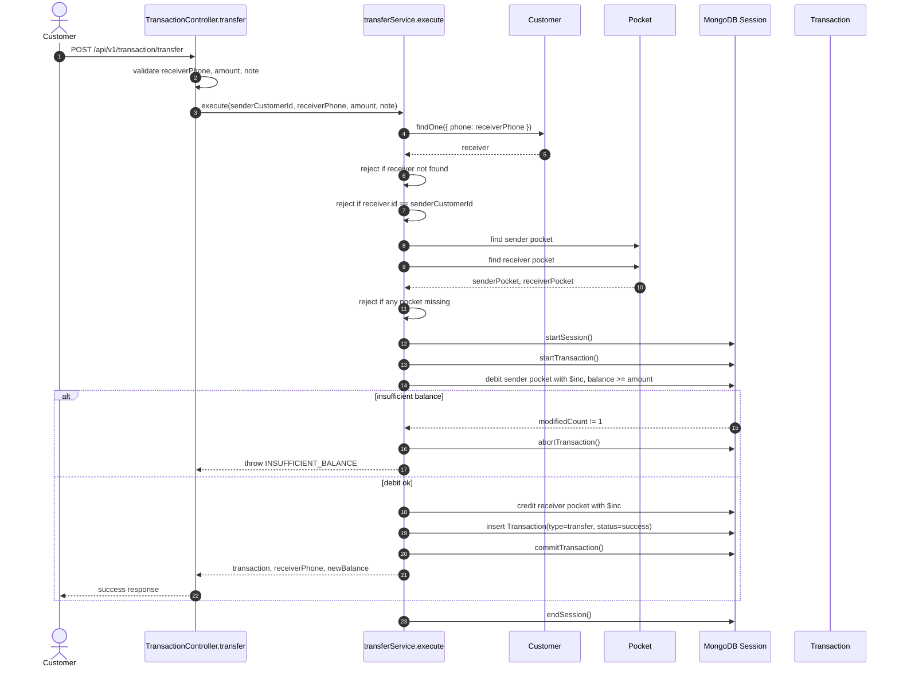
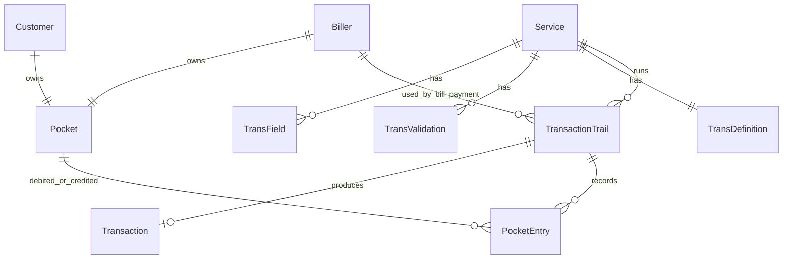
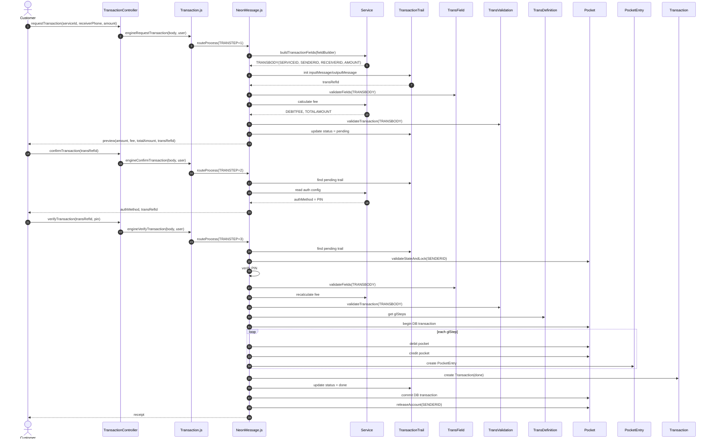
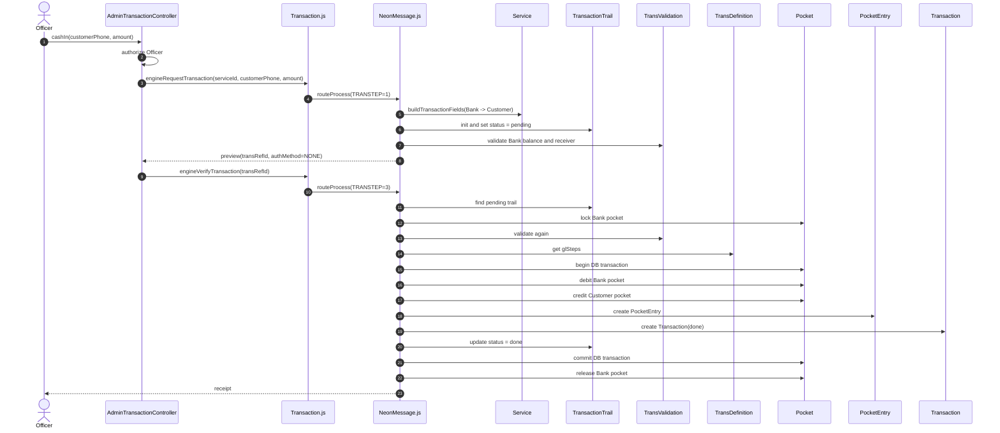
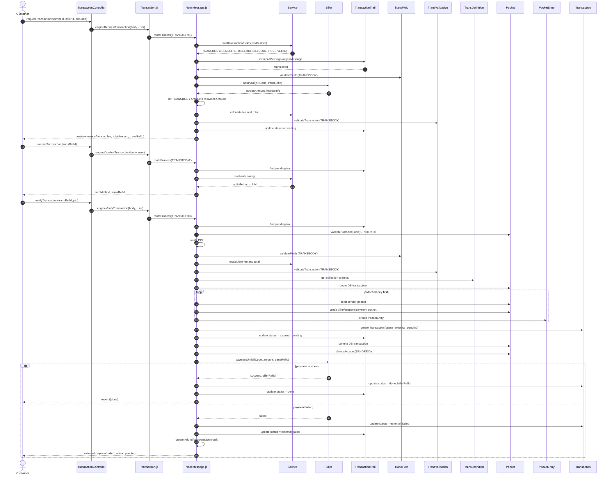

# Mini-Wallet Week 2 Design

Tài liệu này là gói thiết kế mức high-level cho Week 2. Nội dung gồm:

- Sequence P2P đã làm trong mini-mini-wallet (`F:\Self_Sails\wep_app`).
- Overview các model cần có cho mini-wallet config-driven.
- Ba sequence thiết kế: P2P transfer, Cash-in, Bill Payment.

## 1. P2P Sequence Đã Làm Trong Mini-Mini-Wallet

Mini-mini-wallet hiện tại có 3 model chính:

| Model | Vai trò |
|---|---|
| `Customer` | Lưu khách hàng, `phone`, `passwordHash`, liên kết một `Pocket` |
| `Pocket` | Lưu số dư hiện tại của customer |
| `Transaction` | Lưu lịch sử chuyển tiền thành công |

Flow P2P hiện tại nằm ở:

- `TransactionController.transfer`
- `transferService.execute`



Điểm đã làm tốt:

- Có transaction DB thật cho debit/credit.
- Có check receiver tồn tại.
- Có check không chuyển cho chính mình.
- Có check đủ số dư bằng điều kiện `balance: { $gte: amount }`.
- Có ghi `Transaction` sau khi chuyển tiền.

Điểm cần nâng cấp trong mini-wallet Week 2:

- Tách flow thành 3 bước `requestTransaction -> confirmTransaction -> verifyTransaction`.
- Thêm `TransactionTrail` để trace cả giao dịch pending/failed.
- Thêm `PocketEntry` để ghi từng bút toán.
- Thêm config-driven engine thay vì hard-code P2P.
- Thêm fee, PIN auth, checksum, lock account.

## 2. Overview Model Cho Mini-Wallet

### 2.1 Nhóm Identity

| Model | Vai trò chính |
|---|---|
| `Customer` | Người dùng cuối, đăng nhập bằng phone + PIN |
| `Officer` | Admin/operator, trigger cash-in và quản trị config |
| `Biller` | Nhà cung cấp hóa đơn, có `inquiryUrl`, `paymentUrl`, và một pocket nhận tiền |
| `Currency` | Loại tiền, scope hiện tại chỉ cần một currency |

### 2.2 Nhóm Wallet / Ledger

| Model | Vai trò chính |
|---|---|
| `Pocket` | Ví giữ số dư của customer/system/bank/biller, có `balance`, `checksum`, `status` |
| `PocketEntry` | Dòng ghi sổ cho từng bút toán debit/credit |
| `Transaction` | Biên lai chính thức sau khi tiền đã chạy |
| `TransactionTrail` | Hồ sơ runtime của một giao dịch qua Request/Confirm/Verify |

### 2.3 Nhóm Config-Driven

| Model | Vai trò chính |
|---|---|
| `Service` | Khai báo nghiệp vụ, auth, fee, action, fieldBuilder |
| `TransField` | Validate định dạng field trong `TRANSBODY` |
| `TransValidation` | Validate nghiệp vụ bằng các rule function đã code sẵn |
| `TransDefinition` | Chứa `glSteps`, mô tả tiền đi từ ví nào sang ví nào |

### 2.4 Quan Hệ Tổng Quan



## 3. Runtime Chung

```text
requestTransaction -> confirmTransaction -> verifyTransaction
```

| Runtime | Mục đích | Tiền chạy? |
|---|---|---|
| Request | Build input, validate format, inquiry nếu là bill, tính phí, validate nghiệp vụ, tạo Trail pending | Không |
| Confirm | Trả `authMethod` (`PIN` hoặc `NONE`) cho frontend | Không |
| Verify | Lock sender, verify PIN, validate lại, chạy `glSteps`, tạo Transaction/PocketEntry | Có |

Config cần nhìn ra được từ sequence:

| Config | Request | Confirm | Verify |
|---|---:|---:|---:|
| `Service.fieldBuilder` | Có | Không | Không |
| `TransField` | Có | Không | Có |
| `Service.fee` | Có | Không | Có |
| `TransValidation` | Có | Không | Có |
| `Service.auth` | Không | Có | Có |
| `TransDefinition.glSteps` | Không | Không | Có |
| `Biller.inquiryUrl` | Bill only | Không | Không |
| `Biller.paymentUrl` | Không | Không | Bill only, sau khi thu tiền |

## 4. Sequence 1 - P2P Transfer

### 4.1 Config Cần Có

| Config | Nội dung |
|---|---|
| `Service` | `action: none`, `auth: PIN`, fee cố định hoặc phần trăm |
| `fieldBuilder` | `SERVICEID`, `SENDERID`, `RECEIVERPHONE`, `RECEIVERID`, `AMOUNT`, `CURRENCY`, optional `MESSAGE` |
| `TransField` | Bắt buộc có `SERVICEID`, `RECEIVERPHONE`, `AMOUNT`, `CURRENCY` |
| `TransValidation` | Receiver tồn tại, sender != receiver, sender đủ số dư, checksum hợp lệ |
| `glSteps` | Sender -> Receiver cho `AMOUNT`; Sender -> System cho `DEBITFEE` |

### 4.2 Sequence



## 5. Sequence 2 - Cash-in

Cash-in là giao dịch Officer trigger. Customer không tự nạp tiền.

### 5.1 Config Cần Có

| Config | Nội dung |
|---|---|
| `Service` | `action: none`, `auth: NONE`, fee = 0 |
| `fieldBuilder` | `SERVICEID`, `SENDERID` = Bank pocket, `RECEIVERPHONE`, `RECEIVERID`, `AMOUNT`, `CURRENCY` |
| `TransField` | `SERVICEID`, `RECEIVERPHONE`, `AMOUNT`, `CURRENCY` |
| `TransValidation` | Officer hợp lệ, Bank đủ số dư, receiver tồn tại, checksum hợp lệ |
| `glSteps` | Bank -> Customer cho `AMOUNT` |

### 5.2 Sequence



## 6. Sequence 3 - Bill Payment

Bill Payment có 2 external call:

- `inquiryUrl` ở Request để tra hóa đơn và lấy số tiền.
- `paymentUrl` ở Verify, nhưng chỉ gọi sau khi đã thu tiền khách thành công.

Mentor note: không gọi payment trước khi thu tiền khách.

### 6.1 Config Cần Có

| Config | Nội dung |
|---|---|
| `Service` | `action: billerTrans`, `auth: PIN`, fee cố định hoặc phần trăm |
| `Biller` | `inquiryUrl`, `paymentUrl`, `pocketId`, thông tin hóa đơn mẫu |
| `fieldBuilder` | `SERVICEID`, `SENDERID`, `BILLERID`, `BILLCODE`, `RECEIVERID` = biller/suspense pocket, `CURRENCY` |
| `TransField` | `SERVICEID`, `BILLERID`, `BILLCODE`, `CURRENCY` |
| `TransValidation` | Biller active, invoice payable, sender đủ số dư, checksum hợp lệ |
| `glSteps` | Sender -> Biller/Suspense cho `AMOUNT`; Sender -> System cho `DEBITFEE` |

`AMOUNT` không lấy từ customer input. Request gọi `inquiryUrl` rồi ghi đè `TRANSBODY.AMOUNT`.

### 6.2 Sequence



### 6.3 Lưu Ý Thiết Kế Bill Payment

- `inquiryUrl` chỉ tra cứu nên được gọi ở Request.
- `paymentUrl` làm thay đổi trạng thái bên biller nên chỉ gọi sau khi đã thu tiền khách.
- Không đặt HTTP call trong DB transaction.
- `paymentUrl` phải nhận `transRefId` để idempotent.
- Nếu biller fail sau khi đã thu tiền, không xóa transaction cũ; tạo refund/compensation để đối soát.

## 7. Review Checklist

- [ ] Có sequence P2P mini-mini-wallet hiện tại.
- [ ] Có overview model.
- [ ] Có đủ 3 sequence design: P2P, Cash-in, Bill Payment.
- [ ] Từ mỗi sequence nhìn ra config cần có.
- [ ] `TransField` luôn có `SERVICEID`.
- [ ] P2P auth `PIN`, fee về System.
- [ ] Cash-in auth `NONE`, Officer trigger, Bank -> Customer.
- [ ] Bill Payment inquiry ở Request.
- [ ] Bill Payment thu tiền khách trước rồi mới gọi `paymentUrl`.
- [ ] Verify là nơi duy nhất đổi số dư.
- [ ] Debit/credit nội bộ nằm trong DB transaction.
- [ ] Lock sender luôn được release.
